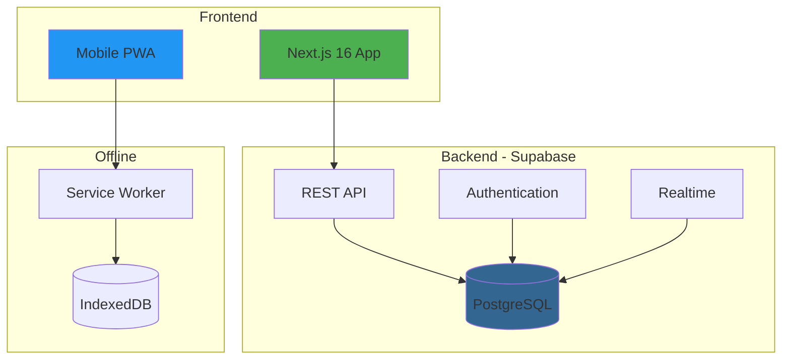

# Business ERP System

> A comprehensive, full-stack Enterprise Resource Planning solution built with Next.js 16, TypeScript, and Supabase

[](https://nextjs.org/)
[](https://www.typescriptlang.org/)
[](https://supabase.com/)
[](https://tailwindcss.com/)
[](LICENSE)

---

## 🎯 Overview

A production-ready ERP system designed for small to medium businesses, featuring **13 integrated modules** covering inventory, sales, procurement, accounting, HR, and fleet management. Built with modern technologies and best practices, this system demonstrates full-stack development expertise with complex business logic, real-time data synchronization, and offline-first mobile capabilities.

### 🌟 Key Highlights

- **88+ Routes** with complete CRUD operations
- **73 PostgreSQL Functions** for business logic automation
- **50+ Database Tables** with advanced relationships
- **Offline-First PWA** with background sync
- **Multi-layer Security** (RLS, RBAC, LBAC)
- **Real-time Updates** via WebSockets
- **Professional PDF/Excel** exports
- **Tax Compliance** with automated tax reports

---

## 🚀 Quick Start

### Prerequisites

- **Node.js** 18+ (LTS recommended)
- **npm** 9+
- **Supabase** account ([free tier available](https://supabase.com))

### Installation

```bash
# Clone the repository
git clone https://github.com/KANAL1234/business-erp-system.git
cd business-erp-system

# Install dependencies
npm install

# Set up environment variables
cp .env.example .env.local
# Edit .env.local with your Supabase credentials

# Run development server
npm run dev
```

Visit [http://localhost:3000](http://localhost:3000) to see the application.

### Database Setup

1. Create a Supabase project
2. Run the schema migration:
   ```bash
   # Copy the SQL from supabase/migrations/business-erp-system.sql
   # Run it in your Supabase SQL editor
   ```
3. Verify tables and functions are created

---

## 💡 Why This Project?

This ERP system showcases:

### Technical Excellence
- **Modern Stack**: Next.js 16 App Router, TypeScript, Supabase
- **Clean Architecture**: Separation of concerns, reusable components
- **Type Safety**: 100% TypeScript coverage with strict mode
- **Performance**: Optimized queries, caching, code splitting
- **Security**: Multi-layer security model with database-level RLS

### Business Value
- **Complete Solution**: End-to-end business management
- **Real-world Complexity**: Handles complex workflows (quote-to-cash, procure-to-pay)
- **Scalable Design**: Multi-location, multi-user support
- **Production Ready**: Zero build errors, comprehensive error handling

### Advanced Features
- **Offline-First**: PWA with IndexedDB and background sync
- **Automated Accounting**: All transactions auto-post to general ledger
- **FIFO Cost Layers**: Accurate COGS calculation
- **Real-time**: WebSocket-based live updates
- **Mobile-Optimized**: Touch-friendly interfaces for field operations

---

## 🎨 Core Modules

<table>
<tr>
<td width="50%">

### 📊 Dashboard & Analytics
Real-time business metrics, KPIs, and quick actions

### 📦 Product & Inventory
Multi-location stock tracking with FIFO/AVCO costing

### 💰 Point of Sale (POS)
Fast checkout with offline support and barcode scanning

### 🤝 Sales & Customers (B2B)
Complete sales pipeline: Quote → Order → Delivery → Invoice

### 🏭 Procurement & Vendors
Purchase orders, goods receipts, vendor bills, payments

### 💼 Accounting & Finance
Double-entry accounting with automated GL posting

</td>
<td width="50%">

### 👥 Human Resources
Employee management, attendance, leave, payroll

### 🚗 Fleet Management
Vehicles, drivers, trips, fuel tracking, GPS

### 📊 Reports & Analytics
Comprehensive reports with Excel/PDF export

### 🔐 Settings & Security
RBAC, LBAC, RLS with granular permissions

### 📱 Mobile PWA
Offline-capable mobile app for POS and fleet

### 🌍 Multi-location Support
Location-based access control and data isolation

</td>
</tr>
</table>

**[→ View Detailed Features](docs/FEATURES.md)**

---

## 🏗️ Architecture



### Key Architectural Decisions

- **Next.js App Router**: Server Components for better performance
- **Supabase**: PostgreSQL with built-in auth, real-time, and RLS
- **React Query**: Server state management with intelligent caching
- **Offline-First**: Service Worker + IndexedDB for mobile reliability
- **Security**: Multi-layer (Auth → RBAC → LBAC → RLS → Audit)

**[→ View Full Architecture](docs/ARCHITECTURE.md)**

---

## 🛠️ Tech Stack

### Frontend
- **Framework**: Next.js 16.1 (App Router)
- **Language**: TypeScript 5
- **Styling**: Tailwind CSS 4
- **UI Components**: Shadcn/ui + Radix UI
- **State**: TanStack React Query v5
- **Forms**: React Hook Form + Zod

### Backend
- **Database**: PostgreSQL 15+ (Supabase)
- **Auth**: Supabase Auth (JWT)
- **API**: Auto-generated REST (PostgREST)
- **Real-time**: Supabase Realtime (WebSockets)
- **Storage**: Supabase Storage (S3-compatible)

### Mobile & PWA
- **PWA**: next-pwa + Workbox
- **Offline**: Dexie.js (IndexedDB)
- **Sync**: Background Sync API

### Export & Reporting
- **Excel**: xlsx (SheetJS)
- **PDF**: jsPDF + jspdf-autotable
- **Charts**: Recharts
- **Maps**: Leaflet + React Leaflet

**[→ View Full Tech Stack](docs/TECH_STACK.md)**

---

## 📊 Project Stats

| Metric | Count |
|--------|-------|
| **Routes** | 88+ pages |
| **Modules** | 13 core modules |
| **Database Tables** | 50+ tables |
| **Stored Procedures** | 73 functions |
| **Triggers** | 20+ automated workflows |
| **Query Hooks** | 27 React Query hooks |
| **UI Components** | 100+ reusable components |
| **Lines of Code** | ~50,000+ LOC |
| **Build Status** | ✅ 0 errors, 0 warnings |

---

## 🔒 Security Features

- **Authentication**: JWT-based with Supabase Auth
- **RBAC**: Role-based access control with granular permissions
- **LBAC**: Location-based access control for multi-location
- **RLS**: Row-level security policies on all tables
- **Audit Trail**: Complete user action tracking
- **Input Validation**: Zod schema validation
- **SQL Injection**: Protected via Supabase client
- **XSS Protection**: React's built-in XSS prevention

---

## 📈 Performance

- **Lighthouse Score**: 90+ (Performance, Accessibility, Best Practices, SEO)
- **First Load JS**: ~200KB (gzipped)
- **Core Web Vitals**: Optimized for LCP, FID, CLS
- **Database**: 100+ indexes for query optimization
- **Caching**: React Query with 5-minute cache
- **Code Splitting**: Automatic route-based splitting

---

## 🧪 Testing

- **System Health Tests**: 16 comprehensive tests covering all modules
- **Manual Testing**: Extensive user acceptance testing
- **Production Build**: Verified with zero errors
- **Cross-browser**: Tested on Chrome, Safari, Firefox
- **Mobile**: Tested on iOS and Android devices

**Run system health tests**: Visit `/system-health` in the application

---

## 📚 Documentation

- **[README.md](README.md)** - This file (project overview)
- **[FEATURES.md](docs/FEATURES.md)** - Detailed feature documentation
- **[ARCHITECTURE.md](docs/ARCHITECTURE.md)** - System architecture
- **[TECH_STACK.md](docs/TECH_STACK.md)** - Technology stack details
- **[DEVELOPMENT_GUIDE.md](docs/DEVELOPMENT_GUIDE.md)** - Development guide
- **[CONTRIBUTING.md](CONTRIBUTING.md)** - Contribution guidelines
- **[CHANGELOG.md](CHANGELOG.md)** - Version history

---

## 🚀 Deployment

### Recommended Stack

- **Frontend**: Vercel (optimized for Next.js)
- **Database**: Supabase Cloud (managed PostgreSQL)
- **CDN**: Vercel Edge Network or Cloudflare

### Environment Variables

```env
NEXT_PUBLIC_SUPABASE_URL=your_supabase_url
NEXT_PUBLIC_SUPABASE_ANON_KEY=your_anon_key
SUPABASE_SERVICE_ROLE_KEY=your_service_role_key
```

### Build Commands

```bash
# Production build
npm run build

# Start production server
npm start

# Deploy to Vercel
vercel deploy --prod
```

---

## 🎓 Learning Outcomes

This project demonstrates proficiency in:

- **Full-Stack Development**: End-to-end application development
- **Modern React**: App Router, Server Components, Hooks
- **TypeScript**: Advanced types, generics, type safety
- **Database Design**: Complex schemas, relationships, optimization
- **SQL**: Advanced queries, stored procedures, triggers
- **Authentication & Authorization**: Multi-layer security
- **State Management**: React Query, form state, global state
- **Performance Optimization**: Caching, code splitting, lazy loading
- **PWA Development**: Offline support, background sync
- **Real-time Features**: WebSocket integration
- **PDF/Excel Generation**: Document generation and export
- **Mobile Development**: Responsive design, touch interfaces
- **DevOps**: CI/CD, deployment, environment management

---

## 🔮 Future Enhancements

- [ ] Multi-currency support
- [ ] Advanced analytics and BI dashboards
- [ ] Email automation (SendGrid/Resend)
- [ ] SMS notifications (Twilio)
- [ ] Native mobile apps (React Native)
- [ ] API for third-party integrations
- [ ] Manufacturing module
- [ ] CRM integration
- [ ] E-commerce integration
- [ ] Multi-company support

**[→ View Full Roadmap](CHANGELOG.md#upcoming-features)**

---

## 📄 License

This project is licensed under the MIT License - see the [LICENSE](LICENSE) file for details.

---

## 👤 Author

**Kanal Chandna**

- GitHub: [@KANAL1234](https://github.com/KANAL1234)
- LinkedIn: [Kanal Chandna](https://www.linkedin.com/in/kanal-chandna/)
- Email: officialkchandna@gmail.com

---

## 🙏 Acknowledgments

- **Next.js** team for the amazing framework
- **Supabase** for the excellent backend platform
- **Shadcn** for the beautiful UI components
- **Vercel** for hosting and deployment
- Open source community for the incredible tools

---

## 📞 Contact & Support

- **Issues**: [GitHub Issues](https://github.com/KANAL1234/business-erp-system/issues)
- **Discussions**: [GitHub Discussions](https://github.com/KANAL1234/business-erp-system/discussions)
- **Email**: officialkchandna@gmail.com

---

<div align="center">

**⭐ Star this repository if you find it helpful!**

**Built with ❤️ using Next.js, TypeScript, and Supabase**

</div>
