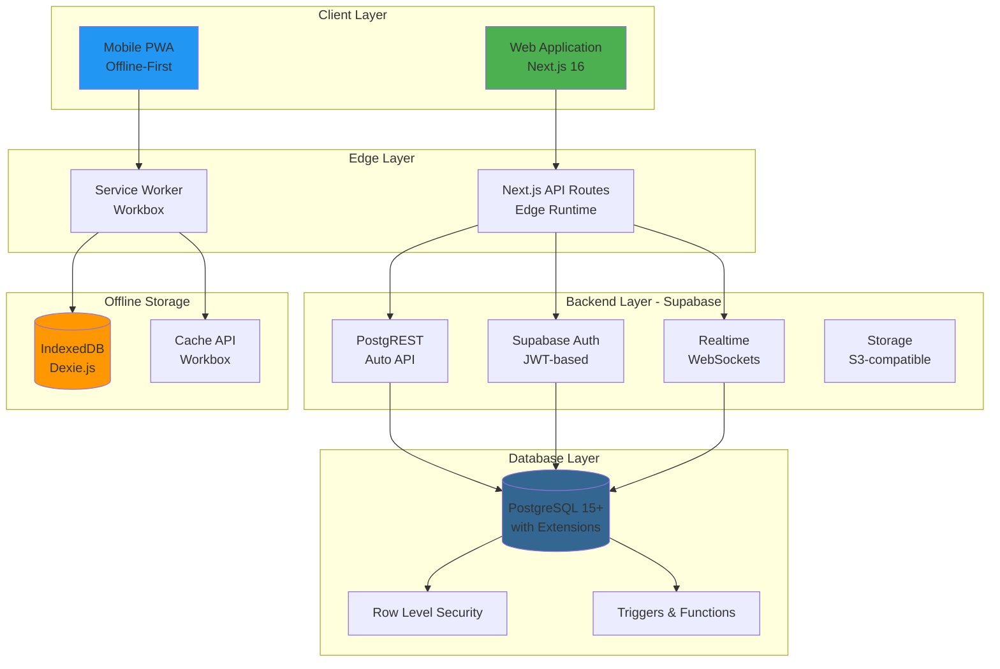
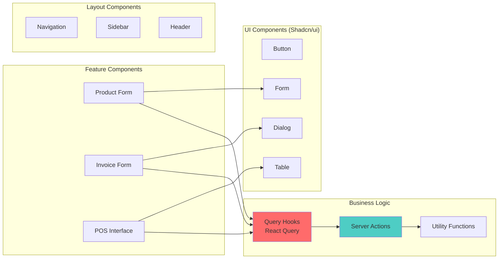
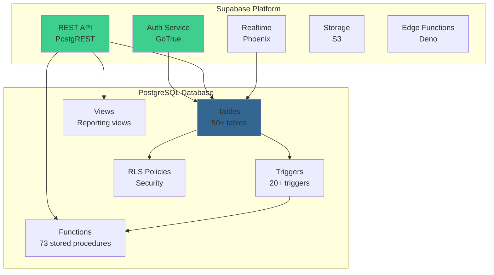
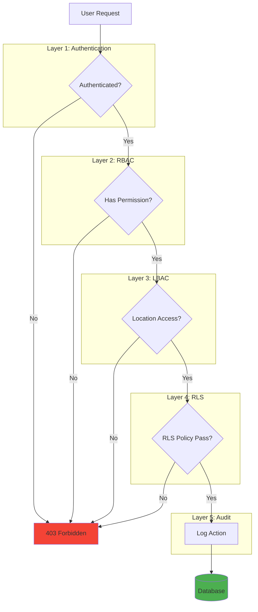
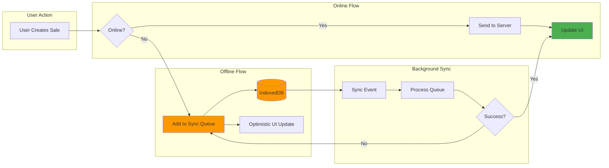
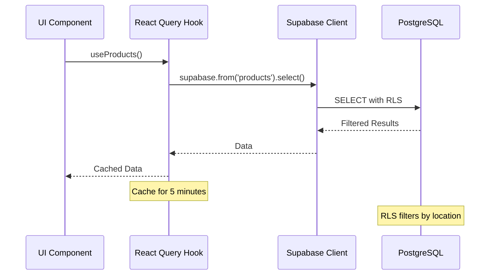
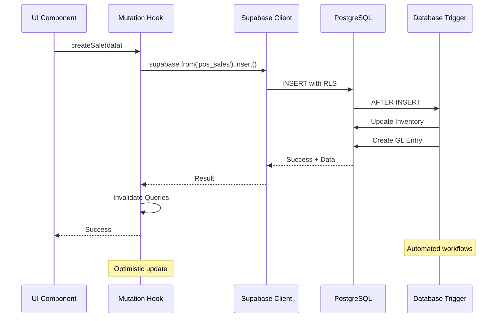
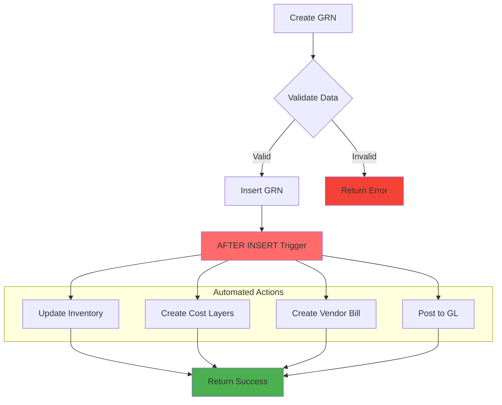
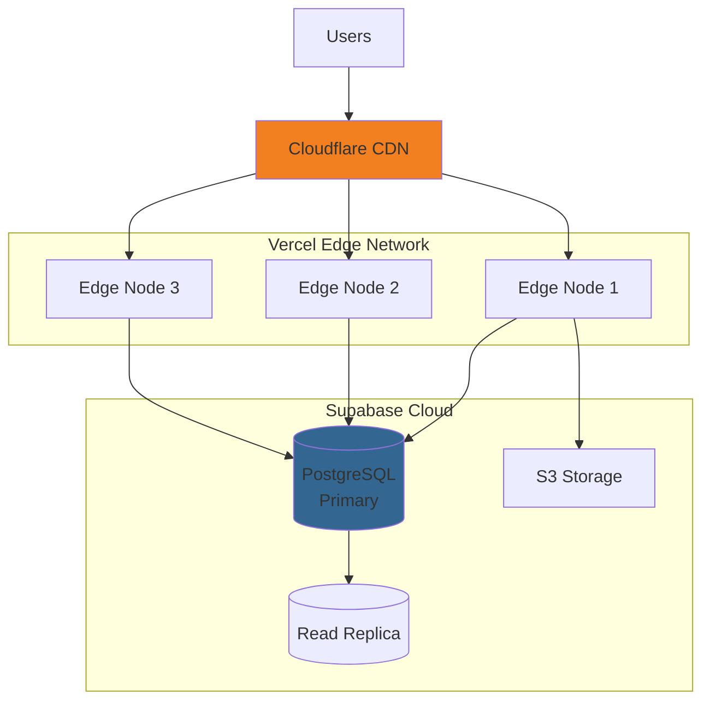
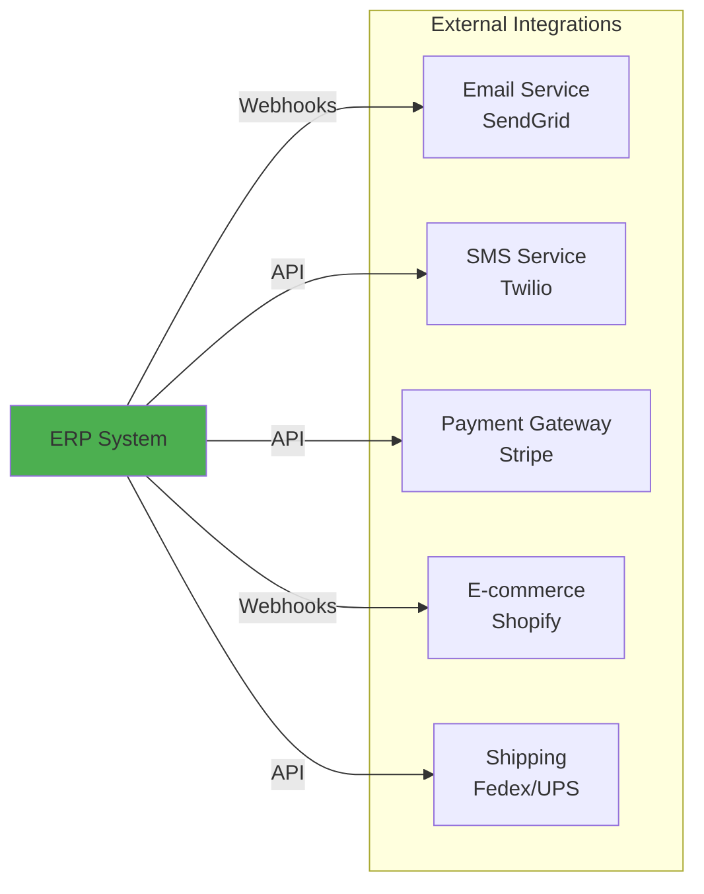

# System Architecture

## Overview

The Business ERP System is built on a modern, scalable architecture using Next.js 16 (App Router), TypeScript, and Supabase (PostgreSQL). The system follows a **serverless, edge-first architecture** with **offline-first mobile capabilities** and **real-time data synchronization**.

---

## High-Level Architecture



---

## Frontend Architecture

### Next.js App Router Structure

```
app/
├── (dashboard)/          # Authenticated routes with dashboard layout
│   └── dashboard/        # Main application routes
│       ├── page.tsx      # Dashboard home
│       ├── products/     # Product management
│       ├── inventory/    # Inventory management
│       ├── pos/          # Point of sale
│       ├── sales/        # B2B sales pipeline
│       ├── purchases/    # Procurement
│       ├── accounting/   # Accounting & finance
│       ├── hr/           # Human resources
│       ├── fleet/        # Fleet management
│       └── settings/     # System settings
├── (mobile)/             # Mobile PWA routes
│   └── mobile/           # Mobile-optimized interfaces
│       ├── pos/          # Mobile POS
│       ├── fuel/         # Fuel logging
│       └── trip/         # Trip management
├── api/                  # API routes
├── login/                # Authentication
└── system-health/        # System tests
```

### Component Architecture



### State Management

**React Query (TanStack Query v5)** for server state:
- Automatic caching and invalidation
- Optimistic updates
- Background refetching
- Pagination and infinite queries

**React Hook Form + Zod** for form state:
- Type-safe form validation
- Performance optimization
- Error handling
- Integration with UI components

**React Context** for global UI state:
- Theme (dark/light mode)
- User session
- Location selection
- Permissions

---

## Backend Architecture

### Supabase Stack



### Database Design Principles

1. **Normalized Schema**: 3NF normalization for data integrity
2. **Referential Integrity**: Foreign keys with cascading rules
3. **Audit Trail**: Created/updated timestamps and user tracking
4. **Soft Deletes**: Logical deletion with `deleted_at` column
5. **Optimistic Locking**: Version columns for concurrent updates

### Key Database Patterns

#### 1. Master-Detail Pattern
```sql
-- Example: Sales Invoice with Items
sales_invoices (header)
  ├── id (PK)
  ├── invoice_number
  ├── customer_id (FK)
  └── total_amount

sales_invoice_items (details)
  ├── id (PK)
  ├── invoice_id (FK) → sales_invoices
  ├── product_id (FK)
  ├── quantity
  └── unit_price
```

#### 2. Document Workflow Pattern
```sql
-- Status progression: draft → pending → approved → posted
status ENUM('draft', 'pending', 'approved', 'posted', 'cancelled')
approved_by UUID REFERENCES users(id)
approved_at TIMESTAMP
```

#### 3. Cost Layer Pattern (FIFO)
```sql
inventory_cost_layers
  ├── product_id (FK)
  ├── location_id (FK)
  ├── unit_cost
  ├── original_quantity
  ├── remaining_quantity  -- Consumed via FIFO
  ├── layer_date
  └── reference_type/id
```

---

## Security Architecture

### Multi-Layer Security Model



### 1. Authentication (Supabase Auth)
- **JWT-based**: Secure token-based authentication
- **Session Management**: Automatic token refresh
- **Password Hashing**: bcrypt with salt
- **Email Verification**: Optional email confirmation

### 2. Role-Based Access Control (RBAC)
- **Permission Format**: `module:feature:action`
- **Examples**: 
  - `inventory:stock:view`
  - `sales:invoices:create`
  - `accounting:journal_entries:approve`
- **Role Templates**: Admin, Manager, Accountant, Cashier, etc.
- **Dynamic Permissions**: Permissions checked at runtime

### 3. Location-Based Access Control (LBAC)
- **User-Location Mapping**: Users assigned to specific locations
- **Data Isolation**: Users only see data for their locations
- **Cross-Location**: Controlled with special permissions
- **Implementation**: Query-level filtering

### 4. Row-Level Security (RLS)
- **Database-Level**: Enforced by PostgreSQL
- **Policy-Based**: Policies define access rules
- **User Context**: Uses `auth.uid()` and `auth.jwt()`
- **Example Policy**:
```sql
CREATE POLICY "Users can view their location's inventory"
ON inventory_stock FOR SELECT
USING (
  location_id IN (
    SELECT location_id FROM user_locations
    WHERE user_id = auth.uid()
  )
);
```

### 5. Audit Trail
- **Action Logging**: All CUD operations logged
- **User Tracking**: User ID, timestamp, IP address
- **Change Tracking**: Before/after values
- **Immutable**: Audit logs cannot be modified

---

## Offline-First PWA Architecture

### Service Worker Strategy



### Offline Storage Strategy

**IndexedDB (via Dexie.js)**:
- Transaction queue
- Product catalog cache
- Customer data cache
- Offline-created records

**Cache API (via Workbox)**:
- Static assets (JS, CSS, images)
- API responses (with TTL)
- Offline fallback pages

### Sync Strategy

1. **Optimistic UI**: Update UI immediately
2. **Queue Transaction**: Store in IndexedDB
3. **Background Sync**: Service worker syncs when online
4. **Conflict Resolution**: Last-write-wins or server-wins
5. **Retry Logic**: Exponential backoff for failures

---

## Data Flow Architecture

### Read Flow (Query)



### Write Flow (Mutation)



### Automated Workflow Example (GRN Processing)



---

## Performance Optimization

### Database Optimization

1. **Indexes**: 100+ indexes on:
   - Foreign keys
   - Frequently queried columns
   - Composite indexes for common queries

2. **Query Optimization**:
   - Use of `EXPLAIN ANALYZE`
   - Materialized views for complex reports (planned)
   - Partial indexes for filtered queries

3. **Connection Pooling**:
   - Supabase connection pooler
   - Transaction mode for short queries
   - Session mode for long transactions

### Frontend Optimization

1. **Code Splitting**:
   - Next.js automatic code splitting
   - Dynamic imports for large components
   - Route-based splitting

2. **Caching Strategy**:
   - React Query cache (5-minute default)
   - Stale-while-revalidate pattern
   - Prefetching for predictable navigation

3. **Image Optimization**:
   - Next.js Image component
   - Automatic WebP conversion
   - Lazy loading

4. **Bundle Optimization**:
   - Tree shaking
   - Minification
   - Compression (gzip/brotli)

---

## Scalability Considerations

### Horizontal Scalability

**Frontend**: 
- Stateless Next.js instances
- Deploy to Vercel Edge Network
- CDN for static assets

**Backend**:
- Supabase auto-scaling
- Read replicas for reporting
- Connection pooling

### Vertical Scalability

**Database**:
- Upgrade PostgreSQL instance size
- Increase connection pool size
- Add read replicas

### Data Partitioning (Future)

- Partition large tables by date
- Archive old data to separate tables
- Implement data retention policies

---

## Monitoring & Observability

### Application Monitoring

- **Error Tracking**: Sentry integration (planned)
- **Performance Monitoring**: Web Vitals tracking
- **User Analytics**: Usage patterns and feature adoption

### Database Monitoring

- **Query Performance**: Slow query log
- **Connection Pool**: Monitor pool usage
- **Table Size**: Track table growth
- **Index Usage**: Monitor index effectiveness

### Audit & Compliance

- **Audit Logs**: All user actions logged
- **Data Retention**: Configurable retention policies
- **Backup Strategy**: Daily automated backups
- **Disaster Recovery**: Point-in-time recovery

---

## Deployment Architecture

### Production Environment



### Deployment Pipeline

1. **Development**: Local development with Supabase local
2. **Staging**: Staging environment for testing
3. **Production**: Production deployment with CI/CD

### Environment Variables

```env
# Supabase
NEXT_PUBLIC_SUPABASE_URL=
NEXT_PUBLIC_SUPABASE_ANON_KEY=
SUPABASE_SERVICE_ROLE_KEY=

# Application
NEXT_PUBLIC_APP_URL=
NODE_ENV=production
```

---

## Technology Decisions & Rationale

### Why Next.js?
- **App Router**: Modern React patterns with server components
- **Performance**: Automatic optimization and code splitting
- **SEO**: Server-side rendering for better SEO
- **Developer Experience**: Hot reload, TypeScript support

### Why Supabase?
- **PostgreSQL**: Powerful relational database with advanced features
- **Real-time**: Built-in WebSocket support
- **Authentication**: Managed auth service
- **Row-Level Security**: Database-level security
- **Cost-Effective**: Generous free tier, predictable pricing

### Why React Query?
- **Caching**: Intelligent caching and invalidation
- **Developer Experience**: Simple API, great DevTools
- **Performance**: Automatic background refetching
- **Offline Support**: Integration with offline strategies

### Why TypeScript?
- **Type Safety**: Catch errors at compile time
- **Developer Experience**: Better autocomplete and refactoring
- **Documentation**: Types serve as documentation
- **Maintainability**: Easier to maintain large codebases

---

## Future Architecture Enhancements

### Planned Improvements

1. **Microservices**: Extract heavy computations to separate services
2. **Message Queue**: RabbitMQ/Redis for async processing
3. **Caching Layer**: Redis for frequently accessed data
4. **API Gateway**: Rate limiting and request routing
5. **GraphQL**: Alternative to REST for complex queries
6. **Event Sourcing**: For complete audit trail and replay
7. **CQRS**: Separate read and write models for scalability

### Integration Architecture (Planned)



---

## Conclusion

The Business ERP System architecture is designed for:
- **Scalability**: Handle growing business needs
- **Performance**: Fast response times and efficient queries
- **Security**: Multi-layer security model
- **Reliability**: Offline support and data consistency
- **Maintainability**: Clean code structure and comprehensive documentation

This architecture supports current business requirements while providing a foundation for future growth and feature additions.
